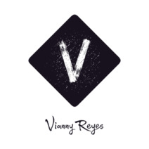

# [My Portafolio](https://portafolio-437cd.web.app/)

## 1. Preámbulo

Mi formación profesional se especializa en el área de desarrollo web, a través del uso de herramientas como ES6, React, CSS, HTML 5,Firesbase, GitHub y Git. Con interés en el desarrollo de soluciones web, buscando que los productos sean de calidad y adecuados a la necesidad del usuario. Me considero curiosa por aprender y comprometida con mi equipo por alcanzar los objetivos.

## 2. Proyectos:

### Proyecto Burger Queen:

[Insert Quest](https://burger-queen-5875f.firebaseapp.com), es una aplicación para tablets diseñada para el pub gamer Insert Coin, donde se puedan tomar órdenes y mandar comandas a cocina sin necesidad de recurrir al papel y lápiz.

### Red Social:

[Bitácora](https://revaldivieso.github.io/SCL012-Social-Network/src/index.html), es la red social diseñada en mobile first para personas que practiquen trekking, aquí pueden encontrar información actualizada aportada por otros usuarios sobre excursiones en Santiago y sus alrededores.

### Películas:

[I am Oscar](https://tamaramunoz.github.io/SCL012-proyecto-peliculas/src/index.html), es una página web con información de las películas nominadas al Oscar para amantes del cine que quieran saber todo acerca de éstas antes de la premiación en febrero de este año 2020.

## 3. Habilidades técnicas:

### [Javascript](https://developer.mozilla.org/es/docs/Web/JavaScript).

### [React](https://es.reactjs.org).

### [HTML](https://developer.mozilla.org/es/docs/Web/HTML).

### [CSS](https://developer.mozilla.org/es/docs/Web/CSS).

### [Firebase](https://firebase.google.com/?hl=es).

### [Node](https://nodejs.org/es/).

### [Git](https://git-scm.com/).

### [Github]().

### [Bootstrap](https://getbootstrap.com).

## 4. Contáctame:

### [correo](reyesvi92@gmail.com).

### [Linkedin](https://www.linkedin.com/in/vianny-reyes-65b919157).
